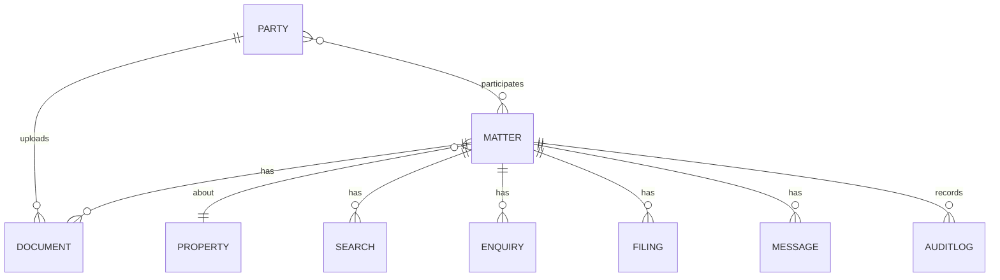
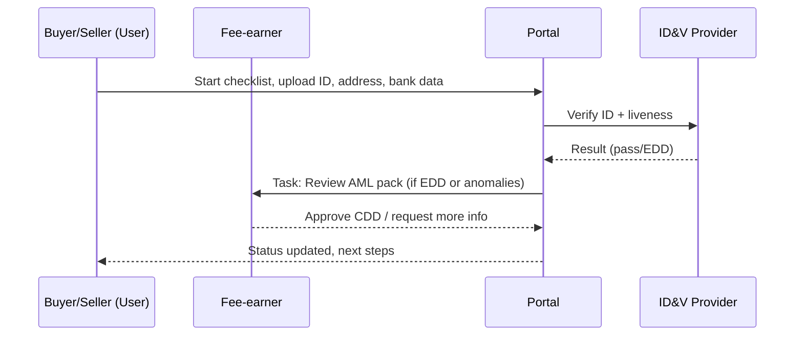
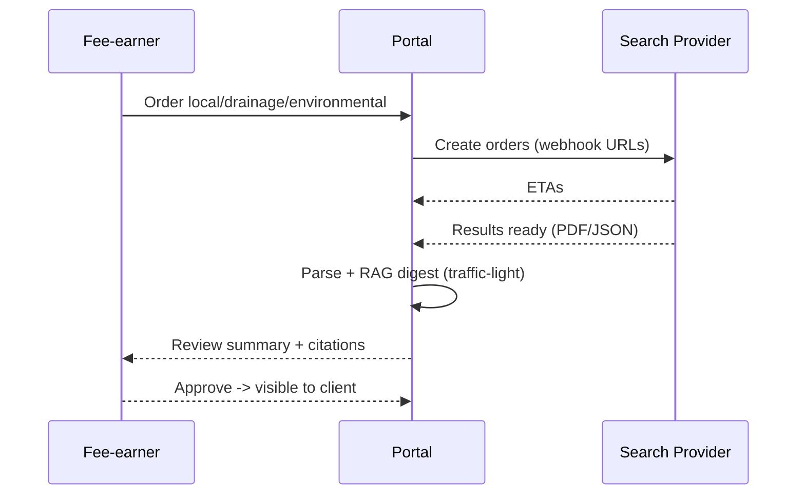
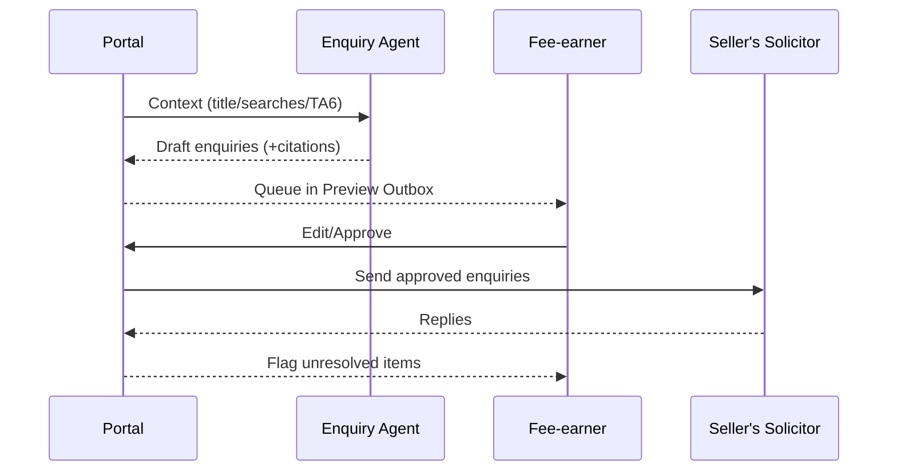
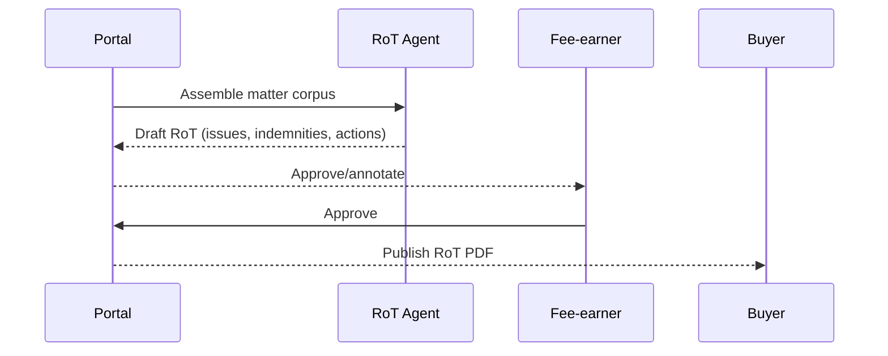
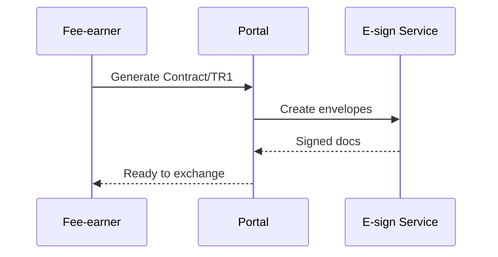

# Conveyancing Portal — MVP Backlog, ERD, Sequences & Pitch

*Last updated: 11 Oct 2025*

---

## 1) MVP Backlog (8–10 weeks target)

### Product Outcomes (MVP)

* Reduce instruction→exchange time by **20–30%**.
* Auto-draft **≥70%** of routine enquiries; **100%** human-reviewed before send.
* Single shared timeline; eliminate “status chasing” emails by **50%**.

### Epics & User Stories

#### Epic A: Client Onboarding & AML/KYC

1. **Guided Intake**
   **As a** buyer/seller
   **I want** a checklist and smart forms for ID, address, source-of-funds, TA6/TA10/TA7
   **So that** I can complete onboarding without emailing PDFs.
   **Acceptance:** mandatory fields enforced; file-type/size checks; progress saved; audit log entry per upload.

2. **ID&V + Liveness**
   **As a** solicitor
   **I want** automated doc verification with liveness and MRZ match
   **So that** AML CDD is satisfied.
   **Acceptance:** pass/fail with reasons; EDD flag; override + justification required.

3. **Source-of-Funds Parser**
   **As a** compliance officer
   **I want** bank-statement parsing/open-banking fetch
   **So that** origin of funds is evidenced.
   **Acceptance:** categorised inflows; gift-letter template; risk score; attach evidence.

#### Epic B: Search Orchestration

4. **Order Core Searches**
   **As a** fee-earner
   **I want** one-click ordering of local, drainage/water, environmental (plus mining by locale)
   **So that** searches are initiated immediately.
   **Acceptance:** provider selection; ETA displayed; webhook/poll for completion.

5. **Parse Search Results**
   **As a** buyer
   **I want** a concise summary with risks (traffic-light)
   **So that** I understand issues.
   **Acceptance:** key findings extracted (adopted roads, flood, contamination, planning constraints); citations to page/para.

#### Epic C: Title Review & Enquiries

6. **Title/Plan Ingest**
   **As a** solicitor
   **I want** automatic extraction of proprietorship, charges, restrictions, easements
   **So that** defects and obligations surface quickly.
   **Acceptance:** JSON extraction; cross-link to registered plan coordinates; confidence score.

7. **Enquiry Drafting Agent**
   **As a** buyer’s fee-earner
   **I want** AI-drafted enquiries from discrepancies (e.g., loft without BR sign-off)
   **So that** I save time.
   **Acceptance:** drafts include citation; tone templates; approval workflow; change tracking.

8. **Report on Title (RoT) Draft**
   **As a** buyer
   **I want** a plain-English report with actions/indemnities
   **So that** I know what I’m buying.
   **Acceptance:** sections: Property, Title, Searches, Mortgage Conditions, Risks, Next Steps; downloadable PDF.

#### Epic D: Comms & Workflow

9. **Shared Timeline & SLA Heatmap**
   **As a** chain participant
   **I want** a single Kanban/timeline with blockers
   **So that** we reduce status-chasing.
   **Acceptance:** stage gates; auto-status from events; manual override with reason; per-party SLA clock.

10. **Solicitor Preview Outbox**
    **As a** solicitor
    **I want** all AI-generated emails/messages to queue for approval
    **So that** liability is controlled.
    **Acceptance:** Approve/Edit/Reject; diff view; audit trail; canned responses.

#### Epic E: Contracts, Exchange & Completion (MVP-scope subset)

11. **Document Assembly**
    **As a** fee-earner
    **I want** auto-fill of Contract, TR1, Completion Statement from structured data
    **So that** I minimise rekeying.
    **Acceptance:** merge fields; e-sign placeholders; versioning.

12. **Funds Instructions (Light)**
    **As a** completions clerk
    **I want** deposit request and completion statement generation
    **So that** payments reconcile.
    **Acceptance:** ledger export; client payment link; status updates.

---

### Non‑Functional Requirements (MVP)

* **Security:** UK/EU data residency, encryption at rest and in transit, field-level redaction.
* **Auditability:** Immutable audit log (actor, action, before/after, timestamp, citations).
* **Performance:** Key pages <1.5s P95; document parsing queued w/ progress bars.
* **Reliability:** 99.5% monthly uptime; idempotent webhooks.
* **Compliance:** Role-based access; data retention controls; subject access export.

### Prioritisation & Estimates (T-shirt)

* A1 Intake forms (M), A2 ID&V (M/L), A3 Source-of-funds (M)
* B4 Order searches (M), B5 Parse results (M/L)
* C6 Title ingest (L), C7 Enquiries drafter (L), C8 RoT draft (M)
* D9 Timeline (M), D10 Preview outbox (M)
* E11 Doc assembly (M), E12 Funds instructions (S/M)

---

## 2) System Design

### 2.1 High-level Architecture

* **Frontend:** React/Next.js (portal), role-based UI.
* **Services:**

  * Ingestion Service (OCR, parsing, classification)
  * RAG Service (vector store per matter, strict scoping)
  * Workflow Service (state machine, SLAs)
  * Integrations Service (ID&V, search providers, e-sign, payments)
  * Documents Service (templating, versions, watermarks)
  * Comms Service (messages, email bridge, approval queue)
* **Stores:** Postgres (OLTP), S3-compatible object store (documents), Vector DB (per matter namespace), Redis (queues, cache).

### 2.2 ERD (MVP)

**Entities**

* **Matter**(id, reference, status, property_id, buyer_party_id[], seller_party_id[], firm_ids[], lender_id, key_dates, created_at)
* **Property**(id, title_no, uprn, address, tenure, plan_assets[], geojson, created_at)
* **Party**(id, role [buyer|seller|fee_earner|supervisor|compliance], name, emails[], phones[], kyc_status, aml_risk, created_at)
* **Document**(id, matter_id, party_id?, type, edition, filename, mime, hash, size, extracted_json, approval_state, created_at)
* **Search**(id, matter_id, kind, provider, request_ref, status, eta, response_blob, parsed_findings_json, severity, created_at)
* **Enquiry**(id, matter_id, to_party_id, from_party_id, draft_text, approved_text, citations[], sent_at, reply_id?, status)
* **Filing**(id, matter_id, type [SDLT|AP1], payload_json, status, external_ref, requisitions_json[], created_at)
* **Message**(id, matter_id, channel[email|portal], draft_text, approved_text, direction, to[], from, status, created_at)
* **AuditLog**(id, actor_id, actor_type[human|agent], action, entity, entity_id, before_json, after_json, ts)

**Relationships (ASCII)**

```
Party (buyer/seller/firm) 1..*        *..1 Matter *..1 Property
          \                                 /
           \-- uploads --> Document <-- relates --/

Matter 1..* Search
Matter 1..* Enquiry
Matter 1..* Message
Matter 1..* Filing
Matter 1..* AuditLog
```

**Mermaid ER Diagram**



---

## 3) Key Sequences

### 3.1 Onboarding & AML



### 3.2 Order & Parse Searches



### 3.3 Enquiries Drafting & Approval



### 3.4 Report on Title (RoT)



### 3.5 Exchange Prep (light)



---

## 4) Pitch Deck (Slide Outline)

### 1. Title — “Conveyancing Co‑Pilot: Faster, Clearer, Safer”

* One workspace for buyers, sellers & firms. AI co-pilot with human sign-off.

### 2. Problem

* 12–20 week timelines; opaque status; repetitive manual drafting; compliance burden.

### 3. Solution

* Shared portal + AI agents (intake, searches, title, enquiries, RoT, filings). Solicitor remains the decision-maker.

### 4. Why Now

* Trading Standards “material information” push, HMLR digitisation, client expectations of real-time status.

### 5. Product Walkthrough (MVP)

* Intake → Searches → Enquiries → RoT → (light) Exchange & Funds.

### 6. Safety & Compliance

* RAG on matter-only data; preview/approval workflows; full audit; UK/EU hosting.

### 7. Integrations

* ID&V, Open Banking, Search providers, E-sign, (later) SDLT + HMLR.

### 8. Go-To-Market

* Start with CQS mid-sized firms; per-matter pricing; white-label.

### 9. ROI Model (Worked Example)

* Firm: 10 fee-earners; today 12 completions/month each → **120**/mo.
* MVP lifts capacity by conservative **15%** via automation & fewer enquiry cycles → **138**/mo.
* Gross margin per matter £400 → +18 matters × £400 = **£7,200/mo**.
* Cost of platform £35/matter × 138 ≈ **£4,830/mo**; net uplift ≈ **£2,370/mo** (+ intangible CSAT & referral lift).

### 10. Roadmap

* Phase 1 (MVP), Phase 2 (SDLT/HMLR), Phase 3 (lender panels, chain sync).

### 11. Team & Moats

* Legaltech + fintech infra; auditability; templates; integrations; data network effects (redacted, aggregate).

### 12. Ask

* 3–5 pilot firms, 3 months, preferred pricing; integration access.

---

## 5) Lightweight Financial Model (editable assumptions)

**Inputs (example):**

* Fee-earners: 10
* Baseline matters per FE per month: 12
* Capacity uplift (MVP): 15–25%
* Gross margin per matter: £400 (fee – direct costs)
* Price: £35 per matter (MVP), scaling tiers later

**Outputs:**

* Added matters/month = 10 × 12 × uplift
* Added gross profit = added matters × £400
* Platform cost = price × total matters post-uplift
* **Net monthly impact** = Added gross profit – Platform cost difference

---

## 6) Acceptance Test Matrix (samples)

| Feature            | Scenario                    | Given/When/Then                                                                                                                                                      |
| ------------------ | --------------------------- | -------------------------------------------------------------------------------------------------------------------------------------------------------------------- |
| Enquiries Drafting | Missing BR sign-off on loft | **Given** title & searches show loft, no BR certificate **When** agent drafts enquiries **Then** include Q citing source, propose indemnity, route to preview outbox |
| Search Parse       | Flood risk                  | **Given** env search = flood zone 2 **When** parsed **Then** red flag in digest + buyer plain-English explanation + link to page                                     |
| RoT                | Publish approved report     | **Given** FE approves RoT **When** publish **Then** buyer sees PDF with version & timestamp                                                                          |

---

## 7) Risks & Mitigations (MVP)

* Hallucinations → strict retrieval, citations, confidence thresholds, required human approval.
* Vendor outages → idempotent queues, retries, provider failover.
* Regulatory drift → config by jurisdiction/edition/date; template versioning.
* Adoption friction → email-in/out bridge; exportable docs; time-tracking hooks.

---

## 8) Next Steps

* Confirm pilot providers (ID&V, search, e-sign).
* Lock schema; create example matter corpus for dev.
* Build Preview Outbox first (high trust lever), then Searches Digest, then Enquiries.

---

**Appendix A — Data Schemas (JSON samples)**

```json
{
  "matter": {
    "id": "m_123",
    "reference": "NG/2025/001",
    "status": "SearchesPending",
    "property_id": "p_456",
    "buyer_party_ids": ["pt_1"],
    "seller_party_ids": ["pt_2"],
    "firm_ids": ["f_buy", "f_sell"],
    "lender_id": "lend_1",
    "key_dates": {"instruction": "2025-10-11"}
  }
}
```

**Appendix B — Message Approval States**

* `drafted_by_agent` → `edited_by_feeearner` → `approved` → `sent` → `delivered`/`failed` → `replied`.
