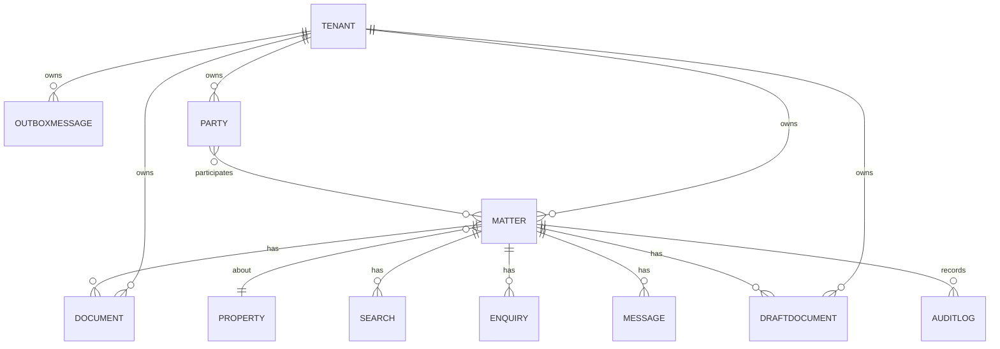

# System Design

High-level architecture, tenancy model, ERD, and service responsibilities.

## Overview

- SaaS, multi-tenant portal operated by our company for multiple solicitor firms and their clients.
- Modular monolith services for MVP with clear seams for future extraction.
- Frontend: role-based React/Next.js; Backend: ASP.NET Core (.NET 9) minimal APIs.

## Multi‑Tenancy

- Tenant = solicitor firm. Firm admins invite users (fee-earners, compliance) and clients (buyers/sellers).
- Tenant resolution: subdomain `{tenant}.portal.example.com` (preferred) or path `/t/{tenant}` in development; custom domains optional.
- Data isolation: every tenant-owned table includes `tenant_id`. EF global filters and optional DB Row-Level Security (RLS) enforce isolation.
- Branding: per-tenant theme (logo/colors) and email templates.

## High-level Architecture

- API Gateway/Ingress → Web/API → Background workers → Integrations → Storage
- Stores: OLTP DB (SQLite dev → Postgres prod), Object Store (docs), Vector DB (later), Cache/Queue (later)

## ERD (MVP with Tenancy)

Key entities (subset): Tenant, Matter (Conveyance), Property, Party, Document, Search, Enquiry, Message (Outbox), DraftDocument, AuditLog.

## Services (MVP)

- Ingestion: OCR, parsing, classification (queued)
- RAG: per-matter namespace (phase 2)
- Workflow: state machine and SLAs (phase 2)
- Integrations: ID&V, search providers, e-sign, payments
- Documents: templating, versions, watermarks
- Comms: Preview Outbox, send pipeline (email/portal)

## Security & Compliance

- OIDC with tenant claims; optional per-tenant SSO (SAML/OIDC).
- Secrets via environment/platform store; PII redaction.
- Immutable audit with before/after JSON and actor identity.

## Frontend Overview

- Next.js app with tenant-aware routing (subdomain or `/t/{slug}`), theming, and role-based navigation.
- Data access via REST (soon tRPC/GraphQL if needed), using TanStack Query for caching and optimistic UI.
